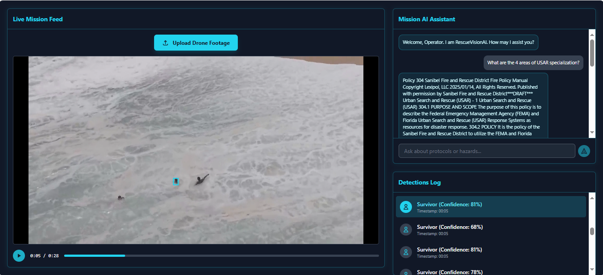

# RescueVision AI Command Center (Front-End)

<p align="center">
  
  
  
  
</p>

**RescueVision** is a sophisticated, web-based command center designed to accelerate search and rescue (SAR) operations by leveraging the power of Artificial Intelligence. This Minimum Viable Product (MVP) serves as an **after-action review and intelligence gathering tool**, allowing operators to rapidly analyze hours of aerial drone footage and pinpoint critical events.

<p align="center">
  
</p>

### Final Application Screenshot


###### **➡️ [View the AI Backend (Python, PyTorch, YOLOv8, RAG) Here](https://github.com/MdEhsanulHaqueKanan/rescue-vision-project)**

The platform fuses two powerful AI capabilities into a single, intuitive interface:
1.  **AI-Powered Video Analysis:** A custom-trained deep learning model automatically scans drone videos to detect and log every instance of a potential survivor.
2.  **A Mission AI Assistant:** A conversational AI, powered by a Retrieval-Augmented Generation (RAG) pipeline, that provides instant, expert-level answers to operator questions based on official FEMA SAR manuals.

This project demonstrates a complete, end-to-end workflow, from a stunning user interface built with modern web technologies to its seamless integration with a powerful, custom-built AI backend.

[**Insert a high-quality GIF or screenshot of the final application in action here!**]

---

## ✨ Core Features (Investor & User Perspective)

### 1. Automated Event Detection & Logging

Instead of forcing an operator to manually scrub through hours of footage, RescueVision automates the process, creating a high-value intelligence report.

*   **Upload & Process:** The operator uploads a drone video file. The system enters a professional "ANALYZING FOOTAGE..." state, clearly communicating that its powerful AI backend is at work.
*   **Automated Log Generation:** After processing, the **Detections Log** is instantly populated with a complete, time-stamped list of every high-confidence detection.
*   **Confidence Scoring:** Each event is tagged with a clear confidence score (e.g., **"Confidence: 83%"**), allowing the operator to prioritize the most likely sightings.

### 2. Flawless, Pixel-Perfect Event Review

This is the core of the user experience. The platform eliminates the ambiguity of real-time tracking in favor of precision analysis.

*   **Click-to-View:** When an operator clicks on any event in the Detections Log (e.g., "Survivor at 00:28"), the video player instantly jumps to that exact timestamp and **pauses**.
*   **Pixel-Perfect Bounding Box:** A single, static, and **perfectly aligned** bounding box is drawn on the paused frame, definitively highlighting the detected survivor. This provides an unambiguous ground truth for the operator.
*   **Clean Playback:** When the operator presses "Play" to view the context around the event, the bounding box cleanly disappears, allowing for an unobstructed view of the footage.

### 3. Integrated AI Mission Support

Operators can instantly access expert-level knowledge without ever leaving the command center interface.

*   **Conversational Q&A:** An operator can ask complex, natural-language questions like `"What are the signs and treatment for hypothermia?"` or `"What is the procedure for a swiftwater rescue?"`
*   **Grounded, Authoritative Answers:** The **Mission AI Assistant** does not hallucinate. It retrieves and displays relevant passages directly from its knowledge base of official FEMA Search and Rescue manuals, providing reliable, life-saving information.

---

## 🛠️ Technology Stack

*   **Frontend Framework:** React, TypeScript, Vite
*   **Styling:** Tailwind CSS
*   **Core Libraries:** OpenCV.js (future), Fetch API
*   **Backend Services:** Two independent Flask-based microservices providing AI capabilities.

---

## 🏁 Getting Started

### Prerequisites

*   Node.js and npm installed
*   The [RescueVision AI Backend](https://github.com/MdEhsanulHaqueKanan/rescue-vision-project) must be running locally.

### Local Installation & Setup

1.  **Clone the repository:**
    ```bash
    git clone [your-repo-url]
    cd rescuevision-ai-command-center
    ```
2.  **Install dependencies:**
    ```bash
    npm install
    ```
3.  **Start the development server:**
    ```bash
    npm run dev
    ```
    *(The application will be available at `http://localhost:5173`)*


---

## 🔬 Future Enhancements & Research Roadmap

The RescueVision platform is a robust MVP, but its architecture is designed for significant future expansion. The following roadmap outlines key areas for further research and development to evolve this tool into a fully-fledged, real-time operational asset.

### 1. Transition to Real-Time Tracking with Frontend Intelligence

*   **Objective:** Evolve from an "Event Reviewer" to a live, real-time tracking system suitable for active missions.
*   **Methodology:**
    *   **Implement a Frontend Tracking Algorithm:** Integrate a lightweight, efficient tracking algorithm (e.g., a Centroid Tracker or a simple Kalman Filter) directly into the React frontend.
    *   **Decouple Detection from Tracking:** The powerful YOLOv8 backend will continue to run at a throttled pace (e.g., 2-3 times per second) to provide high-confidence *detections*. The frontend tracker will use these detections as its "ground truth" and then interpolate the bounding box positions smoothly across the frames in between, running at 60fps.
*   **Expected Outcome:** A flawless, real-time user experience that provides the illusion of a 60fps AI tracker while efficiently managing backend resources, solving the latency problem we observed during initial prototyping.

### 2. Multi-Object and Vehicle Detection

*   **Objective:** Expand the model's capabilities to detect other critical "signs of life" in a disaster zone.
*   **Methodology:**
    *   **Data Sourcing:** Augment the current dataset with labeled images of vehicles (cars, boats), backpacks, and potentially large animals.
    *   **Multi-Class Model Training:** Re-train the YOLOv8 model on this new, multi-class dataset.
    *   **Frontend Updates:** Update the UI to display different colored bounding boxes and icons for each detected class (e.g., blue for 'person', green for 'vehicle').

### 3. Audio Analysis for "Cries for Help"

*   **Objective:** Add another modality to the system by analyzing the drone's audio feed for human vocal distress signals.
*   **Methodology:**
    *   **Research & Model Selection:** Investigate and fine-tune a pre-trained audio classification model (e.g., YAMNet) on a dataset of human sounds, specifically targeting keywords like "help."
    *   **New Microservice:** Develop a third, independent microservice for audio processing that accepts an audio stream and returns timestamped events for potential vocal distress.
    *   **UI Integration:** Add an "Audio Alert" indicator to the Detections Log.

### 4. Deployment to Edge Devices

*   **Objective:** Move the AI inference from a cloud/local server to a low-power, high-efficiency computer on the drone itself for true autonomy.
*   **Methodology:**
    *   **Model Optimization:** Convert the trained PyTorch model to a more efficient format like ONNX or TensorRT.
    *   **Quantization:** Further optimize the model by converting its weights from 32-bit floating points to 8-bit integers, drastically reducing its size and computational requirements.
    *   **Edge Deployment:** Deploy the optimized model to an edge device like an **NVIDIA Jetson Nano** mounted on the drone.
